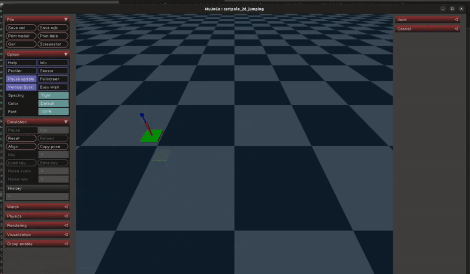
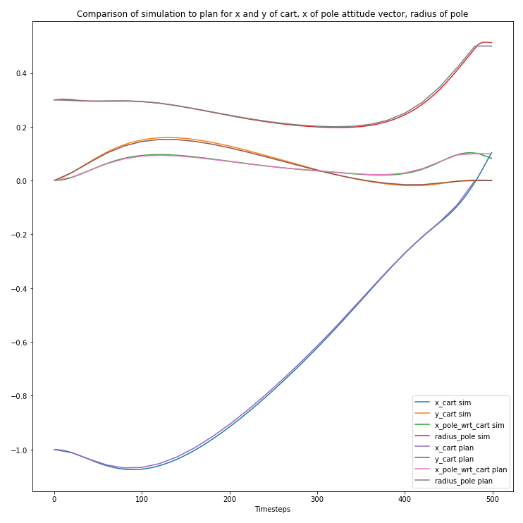

Jupyter notebook will create dynamics model, optimize over it, apply controls to simulation, and plot resulting trajectories.

Currently only ground phase before jump works, optimizing over jump dynamics has not been accomplished. This is because converting from ground state vector to rigid body angular and linear momentum involve a square root, making CasADi unhappy. I have not figured out a workaround yet. However, it is trivial to constrain the jump to be purely vertically oriented. In the jump shown below the final state in the ground stage is defined by hand, resulting in a jump.

To save computation time the optimization timestep is 20 times the simulation timestep. The planned control inputs are linearly interpolated.

File description:
- 2d-jumping-cartpole.xml: MJCF formatted XML used to define MuJoCo systems
- dynamics_model.py: Static methods to generate manipulator matrices M, C, G given casadi expressions T, V, q, q_dot
- trajopt_setup.py: Utility functions to generate trajectory optimization data structures
- [X]to[Y]interpolated.csv: CSV files containing pre-generated state and input plans, can be loaded to avoid having to re-optimize

